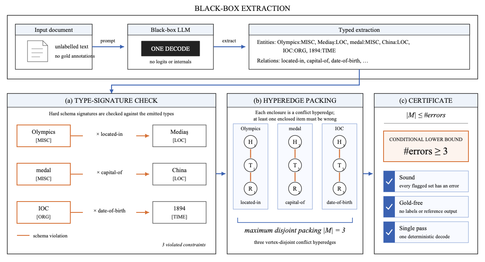
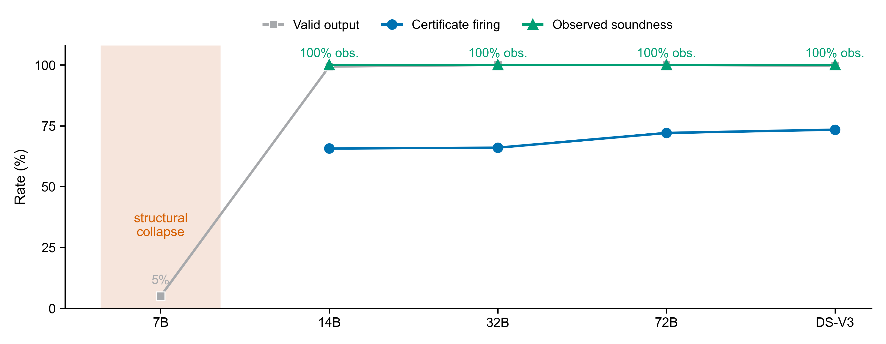
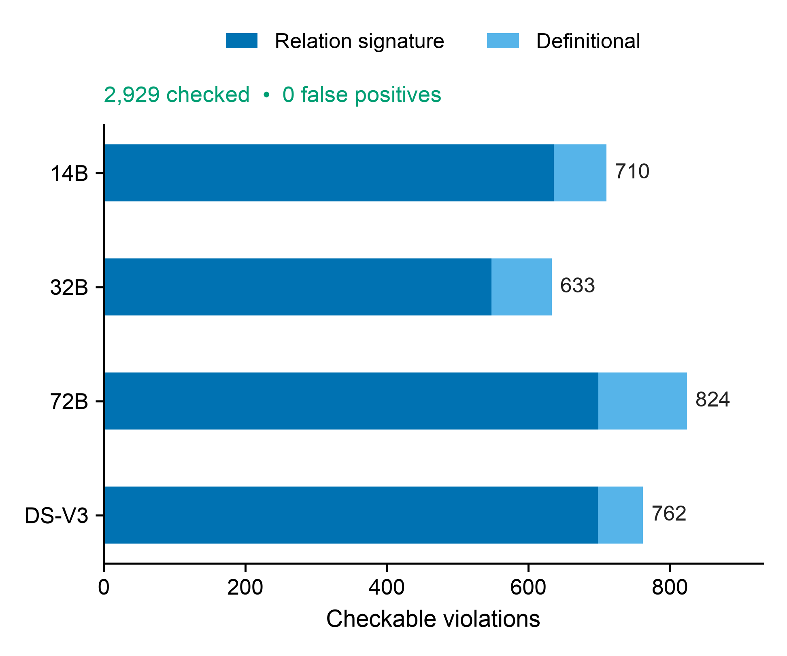
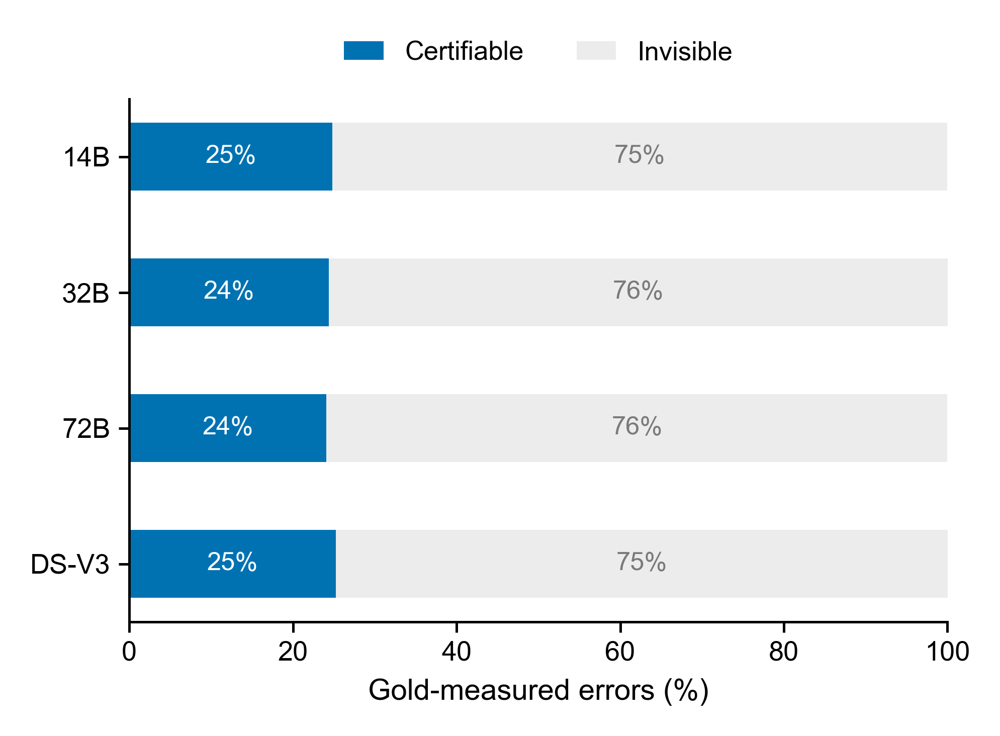
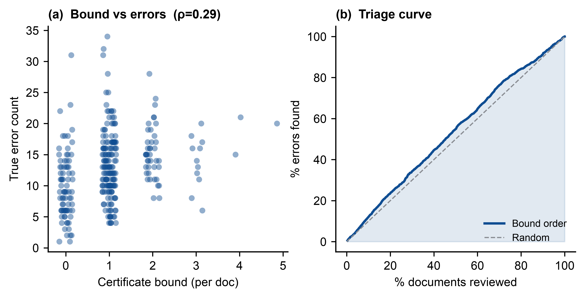

# Consistency Certificates

**Gold-free error lower bounds for black-box large language model information extraction, conditional on valid constraints.**

This repository contains the code, cached model outputs, and analysis scripts behind the paper
*"Consistency Certificates: Gold-Free Error Bounds Under Valid Constraints for Black-Box Large
Language Model Information Extraction"* (IEEE Access, under review). Every number in the paper is
reproducible offline from the cached data; no API key is needed to reproduce the results.

**Public code:** [github.com/lijiajia3/consistency-certificates](https://github.com/lijiajia3/consistency-certificates)

A *consistency certificate* audits a black-box extractor's own output. When the output violates a
hard type-signature constraint (for example, a `date-of-birth` relation whose head is not a person),
it is internally self-contradictory, so **at least one extracted item must be wrong if the constraint
is valid**. Each violation is a hyperedge containing the emitted items that cannot all be correct. The
maximum number of vertex-disjoint conflict hyperedges gives a **conditional lower bound** on the
number of errors, computed from a **single decode with no gold reference**. The packing–hitting-set inequality is a classical
result from database repair and consistent query answering; the contribution here is its operational transfer to
black-box, document-level LLM information extraction, plus a multi-model, multi-source empirical
characterization of what it can and cannot certify.

## How it works



*Figure 1: A single black-box decode is checked against hard constraints; under valid constraints,
disjoint hyperedge packing turns the resulting violations into a conditional, gold-free error floor.*

1. **Extract.** A black-box LLM is prompted (JSON mode, temperature 0) to emit typed entities and
   relations from a document using one decode and output text only.
2. **Check.** Each emitted relation is checked against the *hard type-signature* its relation admits
   (e.g. `located-in` requires a `LOC`/`ORG` head). A violation is internally self-contradictory, so
   at least one of the implicated items is wrong.
3. **Certify.** Under valid constraints, an exact maximum packing of vertex-disjoint conflict hyperedges is a
   **sound lower bound** on the number of wrong items without gold labels, model internals, or resampling.
4. **Compose.** The certificate covers errors that are *internally inconsistent*; it complements
   self-consistency (which misses stable, self-consistent errors), precision-side signals, and
   recall-side coverage estimates.

## Key results

| Setting | Metric | Value |
|---|---|---|
| Hold-out signatures (disjoint document split) | out-of-sample soundness | **99.8%** (3495 / 3501; exact 95% CI 99.63–99.94%) |
| Schema-only signatures (Wikidata semantics, **zero corpus**) | soundness | **98.5%** (3076 / 3122; exact 95% CI 98.04–98.92%) |
| Independent SciERC corpus | soundness | **100%** (134 / 134; exact 95% CI 97.28–100%) |
| Definitional-signature audit (4 models) | observed false positives | **0 / 340**; one-sided 95% upper bound **0.88%** |
| Construction-aligned empirical diagnostic | observed false positives | **0 / 2547**; not treated as independent validation |
| Cross-architecture control (GLM-4-32B) | observed false positives | **0 / 1085** over 300/300 valid documents |
| Firing rate (empirical signatures) | documents with a non-zero bound | **66–73%** |
| Detectable class | share of gold-verifiable emitted errors participating in conflicts | **24.1–25.2%** |
| Qwen2.5-32B self-consistency | certified errors recurring in at least 3 of 5 decodes | **21 / 95 = 22.1%** (exact 95% CI 14.2–31.8%) |
| Five-model self-consistency | stable certified-error range (50 documents/model, 5 decodes) | **13.9–39.9%** (14B 13.9%, 32B 22.1%, 72B 35.3%, DeepSeek 39.9%, GLM 19.8%) |
| Weak-model cliff | Qwen2.5-7B valid structured output | **5%** |



*Figure 2: The weak-model failure is structural; every checkable in-source violation from each
usable extractor contains a gold-measured error, and firing is 66–73%.*

| Checkable violations and soundness | Detectable error class |
|:---:|:---:|
|  |  |

*Figures 3 and 6: Figure 3 compares definitional, disjoint-document, schema-only, and independent-corpus
validation. The 0/340 definitional result has a one-sided 95% false-positive-rate upper bound of 0.88%.
By construction, the certificate exposes only the internally inconsistent 24.1–25.2% of gold-verifiable
emitted errors.*

Evaluation runs on **297 Re-DocRED documents** on which all four usable extractors produce valid
structured output. DeepSeek-V3 was re-queried over the full 300-document dev split (299 valid
outputs, one empty), so no extractor's coverage is partial in the released data.

Observed soundness is **99.8%** for disjoint-document signatures, **98.5%** for a fully
corpus-independent schema, and **100%** for 134 checkable violations on independently annotated
SciERC. The 0/2547 empirical result shares an annotation family between
signature construction and validation, so it is reported only as a construction-aligned diagnostic. The theorem
(`#errors ≥ maximum vertex-disjoint hyperedge packing`) holds on every document and the exact
solver is separately checked against exhaustive enumeration on 500 random conflict hypergraphs.



*Figure 9: The certificate provides a weak positive triage signal, not a total-error estimator.*

Editable SVG, print-ready PDF, and high-resolution PNG versions of all publication figures are
available in [`result/figs/`](result/figs/).

## Reproduce

The cached extractions are included, so every number in the paper can be recomputed offline without
querying any API. The paper workflow takes one command after setup:

The unabridged extraction prompt (including the ordered 18-relation list) is generated by
`build_prompt` in `code/common.py`. Gold alignment uses ambiguity-aware entity-cluster identifiers:
normalized exact aliases, best containment, retention of tied candidates, and abstention when their
gold types conflict. Re-DocRED is identified by DOI
[`10.18653/v1/2022.emnlp-main.580`](https://doi.org/10.18653/v1/2022.emnlp-main.580).
SciERC is identified by DOI [`10.18653/v1/D18-1360`](https://doi.org/10.18653/v1/D18-1360).

```bash
# Setup
python3 -m venv .venv && source .venv/bin/activate
pip install -r requirements.txt

# All numerical analyses and Figures 1--11
python3 code/reproduce_all.py
```

The workflow writes one readable log per analysis, the exact 297 common-set document indices and
titles (`common_document_ids.json`), and a machine-readable environment manifest to
`result/reproduction/`. To verify every numerical result without regenerating figure files, run
`python3 code/reproduce_all.py --skip-figures`.

Individual components can also be run separately:

```bash
# Theorem unit tests + 500-random-hypergraph exhaustive cross-check
python3 code/certificate.py

# Main results table (construction-aligned diagnostic, firing, detectable class)
python3 code/analyze.py

# Soundness ablations (99.8% hold-out, 98.5% schema-only)
python3 code/ablation_holdout.py
python3 code/ablation_schema.py

# Cross-architecture control and multi-model self-consistency analysis
python3 code/analyze_glm.py
python3 code/analyze_resample.py

# Reviewer-2 robustness analyses and independent SciERC evaluation
python3 code/analyze_revision.py
python3 code/analyze_scierc.py --require-complete

# Triage correlation and figure regeneration
python3 code/analyze_triage.py
python3 code/make_figures_pub.py
```

All scripts live in `code/` and resolve data paths relative to the repository root, so they run from
any working directory.

To re-run extraction from scratch (needs a SiliconFlow API key, see below):

```bash
NDOCS=300 WORKERS=4 python3 code/run_extractions.py          # all models
ONLY_MODELS=GLM NDOCS=300 WORKERS=3 python3 code/run_extractions.py   # a single model
```

Extraction is cached per `(model, document)` and resumable; existing results are skipped.

To audit a new structured extraction directly, provide a JSON file with `entities` and `relations`
arrays. The command returns every implicated item and the document-level certified error floor:

```bash
python3 code/audit_output.py path/to/extraction.json --constraints all
```

## What you can use the code for

- Audit a new black-box information extraction output using empirical, definitional, or functional
  constraints, provided those constraints are valid for the target schema.
- Return the implicated output items and a conditional document-level error lower bound from one decode.
- Reproduce the main soundness, firing, detectable-class, hold-out, schema-only, cross-family,
  self-consistency, and triage analyses from the released cached outputs.
- Regenerate all eleven publication figures as editable SVG, print-ready PDF, and high-resolution PNG.
- Re-run the original extraction or stochastic-resampling pipelines when a SiliconFlow API key is
  available; these online steps are optional and are not needed to reproduce the paper.

## Repository layout

```
consistency_certificates/
├── code/                   # all analysis scripts (paths resolve relative to repo root)
│   ├── common.py           # shared constants, prompt, violations, gold-free bound
│   ├── audit_output.py     # CLI: audit one new extraction and return a certificate
│   ├── certificate.py      # exact hypergraph packing + exhaustive randomized cross-check
│   ├── reproduce_all.py    # one-command offline reproduction + per-task logs and manifest
│   ├── run_extractions.py  # concurrent, cached black-box extraction (SiliconFlow API)
│   ├── analyze.py          # main results table (soundness, firing, detectable class)
│   ├── run_resample.py     # E5: K=5 stochastic decodes at T=0.7
│   ├── analyze_resample.py # multi-model self-consistency overlap
│   ├── analyze_revision.py # robustness, tightness, taxonomy, and review-budget analyses
│   ├── analyze_scierc.py   # independent-corpus evaluation
│   ├── analyze_triage.py   # E6: per-document bound vs true error count (Spearman)
│   ├── analyze_glm.py      # GLM-4-32B cross-architecture metrics
│   ├── ablation_holdout.py # two-fold hold-out signature ablation (99.8%)
│   ├── ablation_schema.py  # schema-only (zero-corpus) signature ablation (98.5%)
│   ├── pilot.py            # minimal go/no-go pilot (15 docs, needs API key)
│   ├── make_figures.py     # legacy figures (gradient, self-consistency, triage)
│   ├── make_figure1_svg.py # editable IEEE-style concept schematic (F1)
│   ├── make_figures_nature.py # Nature-style statistical figures (F2-F11)
│   └── make_figures_pub.py # publication figures F1-F11 (svg + pdf + png)
├── data/                   # input data
│   ├── relations.json      # empirical (head-type, tail-type) signatures for 18 relations
│   ├── redocred_dev_{15,50,100,300}.json   # Re-DocRED dev splits (gold for validation only)
│   └── scierc/              # official processed train/dev/test data and source metadata
├── result/                 # all outputs
│   ├── extractions/        # cached model outputs, one JSON per (model, document)
│   ├── resample/           # cached stochastic decodes for all usable primary models
│   ├── figs/               # generated figures (.pdf, .svg, .png)
│   └── RESULTS.md          # results summary
├── README.md
├── requirements.txt        # tested Python dependency versions
└── LICENSE
```

The journal submission package contains the manuscript source and point-by-point response. Those
author-facing submission files are kept outside this public code-and-data repository.

## Data and models

- **Datasets:** [Re-DocRED](https://github.com/tonytan48/Re-DocRED) validation split and
  [SciERC](https://nlp.cs.washington.edu/sciIE/). Gold
  annotations are used only to *validate* the certificate, never to run it.
- **Models (via SiliconFlow):** Qwen2.5-{7B, 14B, 32B, 72B}-Instruct, DeepSeek-V3, and
  GLM-4-32B-0414 as a cross-architecture control. We queried every model as a black box in JSON mode
  at temperature 0.
- **Constraints:** relation type signatures (empirical and definitional), functional-relation
  consistency, and a schema-only variant derived from Wikidata property semantics with no corpus.
  Functional constraints are reported as a separate firing-only analysis in the paper; they are not
  pooled into the gold-audited headline soundness or bound-tightness results.

## Notes on reproducibility

- Numbers may shift by a fraction of a percent if you re-query the API, because provider models are
  updated over time. The cached outputs in `extractions/` are the exact ones behind the reported results.
- No API key is stored in this repository. For re-extraction, put your key in `~/.siliconflow_key`;
  the certificate itself needs no API at run time.

## Citation

```bibtex
@article{guo2026consistency,
  title   = {Consistency Certificates: Gold-Free Error Bounds Under Valid Constraints
             for Black-Box Large Language Model Information Extraction},
  author  = {Guo, Dongdong and Li, Jiaxuan},
  journal = {IEEE Access},
  year    = {2026},
  note    = {Under review}
}
```

## License

Released for research and reproducibility. See `LICENSE` (MIT).
